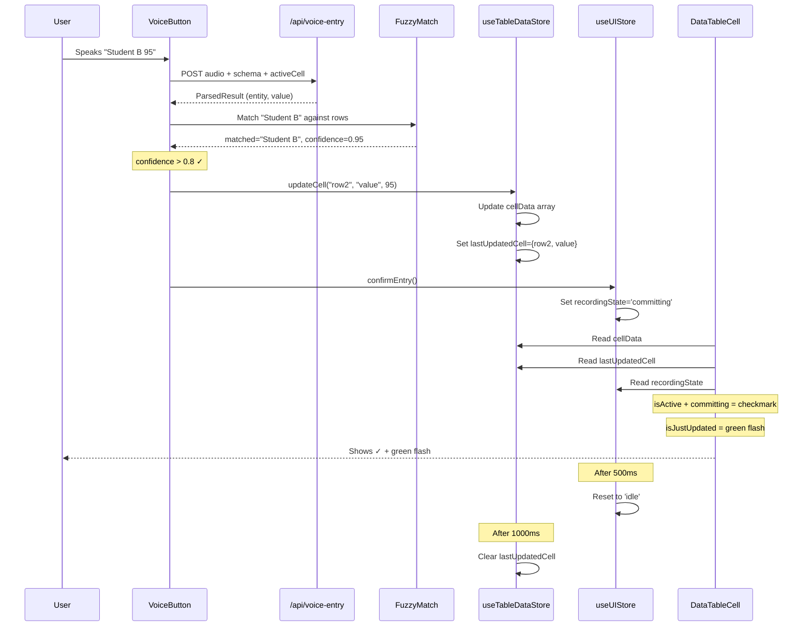
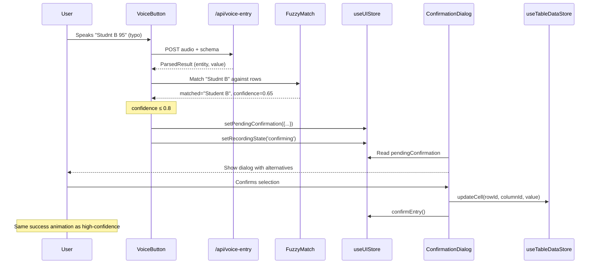

# Voice-to-Store Data Flow

## High-Confidence Match Flow (>0.8)



## Low-Confidence Match Flow (≤0.8)



## Store Structure

```typescript
// useTableDataStore
{
  cellData: [
    { rowId: 'row1', columnId: 'value', value: 95 },
    { rowId: 'row2', columnId: 'value', value: 87 },
    // ...
  ],
  lastUpdatedCell: { rowId: 'row2', columnId: 'value' },
  
  // Actions
  updateCell(rowId, columnId, value) { ... },
  setCellData(data) { ... },
  getCellValue(rowId, columnId) { ... },
  clearLastUpdated() { ... }
}

// useUIStore
{
  activeCell: { rowId: 'row2', columnId: 'value' },
  recordingState: 'committing', // idle | listening | processing | confirming | committing | error
  pendingConfirmation: {
    entity: 'Student B',
    value: 95,
    confidence: 0.65,
    alternatives: [...]
  },
  
  // Actions
  confirmEntry() { ... },
  setRecordingState(state) { ... },
  setPendingConfirmation(data) { ... }
}
```

## Visual States

### Cell Appearance by State

| State | Visual | CSS Classes |
|-------|--------|-------------|
| **Idle** | Normal | `text-gray-900` |
| **Active** | Blue border + corner | `ring-2 ring-blue-500` + blue triangle |
| **Listening** | Blue + pulse | `bg-blue-100 animate-pulse` |
| **Processing** | Yellow | `bg-yellow-50` |
| **Confirming** | Orange | `bg-orange-50` |
| **Committing** | Green + checkmark | `bg-green-500/20` + ✓ |
| **Just Updated** | Green flash | `animate-[flash_0.5s]` + `animate-[fadeOut_1s]` |

### Animation Layers (Z-index)
1. Base background (z-0)
2. State-specific background (z-0)
3. Green flash overlay (z-1, pointer-events-none)
4. Cell value text (z-10)
5. Blue corner indicator (absolute, top-right)
6. Checkmark overlay (absolute, inset-0, when committing)
