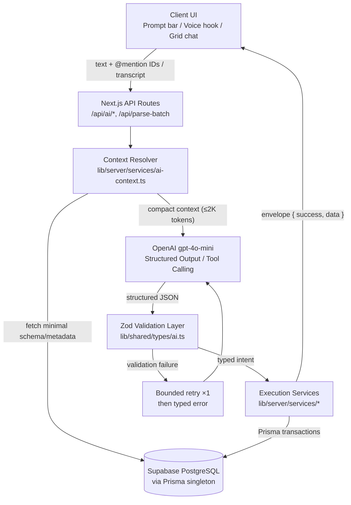
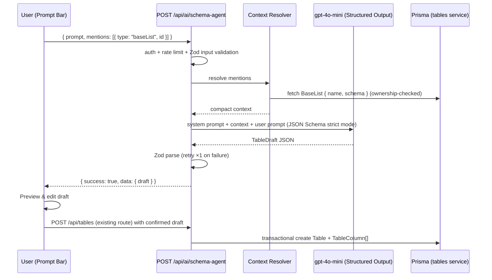
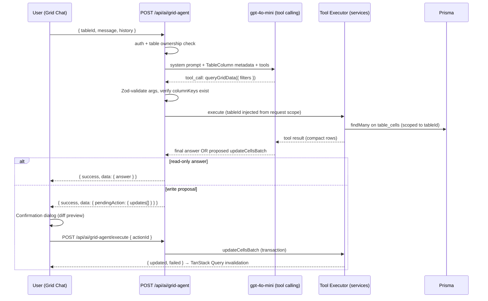
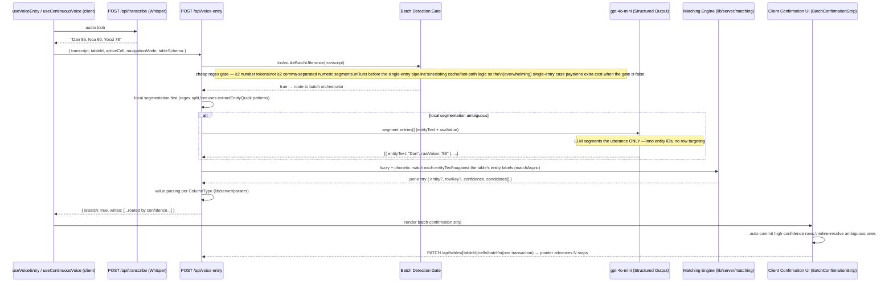

# VocalGrid AI Agent System — Architecture Spec & PRD

**Feature:** 03 — AI Table Agent
**Priority:** High
**Dependencies:** 02_ARCHITECTURE.md, 03_DATABASE.md, 07_MATCHING_ENGINE.md, 11_API_ROUTES.md, 14_PRODUCT_DATA_FLOW.md, `prisma/schema.prisma`
**Status:** Spec — Not Started
**Last Updated:** 2026-07-23

---

## Table of Contents

1. [Executive Summary & AI Design Principles](#1-executive-summary--ai-design-principles)
2. [System Architecture & Context Flow](#2-system-architecture--context-flow)
3. [Pillar 1: Schema Agent & `@Mention` Resolution](#3-pillar-1-schema-agent--mention-resolution)
4. [Pillar 2: Grid Agent & MCP / Tool Definitions](#4-pillar-2-grid-agent--mcp--tool-definitions)
5. [Pillar 3: Multi-Entity Batch Voice Entry](#5-pillar-3-multi-entity-batch-voice-entry)
6. [Database & Schema Considerations](#6-database--schema-considerations)
7. [Implementation Milestones & Phasing](#7-implementation-milestones--phasing)

---

## 1. Executive Summary & AI Design Principles

VocalGrid's AI Agent System extends the existing voice pipeline (Whisper STT → GPT-4o-mini parsing → fuzzy matching) into three agentic capability pillars:

| Pillar | Capability | Entry Point |
|---|---|---|
| **1. Schema Agent** | Natural-language table creation with `@Mention` RAG over `BaseList` metadata | `POST /api/ai/schema-agent` |
| **2. Grid Agent** | Tool-calling agent for querying and batch-updating live grids | `POST /api/ai/grid-agent` |
| **3. Batch Voice Parser** | Single-roundtrip parsing of multi-entity transcripts ("Dan 85, Noa 90, Yossi 78") | `POST /api/parse-batch` |

### 1.1 Design Principles

1. **LLM proposes, TypeScript disposes.** The model never executes anything. It returns structured intent (a schema draft, a tool call, an extraction list). Deterministic backend services in `lib/server/services/` validate with Zod and execute via the Prisma singleton (`lib/prisma.ts`). Every write is auth-scoped and RLS-backed.
2. **Context diet.** Prompts carry only the minimal context resolved for the request: the `@Mention`-referenced `BaseList` schema, the active `Table`'s `TableColumn` list, or the entity label set — never a database dump. Target ≤ 2K input tokens per request.
3. **Latency budgets.**

   | Operation | Budget (p95) | Notes |
   |---|---|---|
   | Schema Agent (draft) | ≤ 3.0 s | Interactive but not conversational-blocking |
   | Grid Agent query (single tool round) | ≤ 2.5 s | One LLM turn + one DB query |
   | Grid Agent batch update (with confirm) | ≤ 3.5 s + user confirm | Writes gated behind confirmation |
   | Batch voice parse (post-STT) | ≤ 1.5 s | Must feel like the existing single-entry `/api/parse` |

4. **Cost/token efficiency.** All three pillars use `gpt-4o-mini` ($0.15/1M input, $0.60/1M output). At ≤ 2K input / ≤ 500 output tokens, worst-case cost is ~$0.0006 per request — three orders of magnitude below infra cost concerns at MVP scale. No GPT-4-class model is required; structured output constraints do the heavy lifting.
5. **Deterministic guardrails.**
   - Every LLM response is parsed against a Zod schema (`lib/shared/types/`); parse failure triggers one bounded retry with the validation error appended, then a typed error to the client.
   - `ColumnType` values are constrained to the Prisma enum: `TEXT | NUMBER | DATE | BOOLEAN`.
   - Destructive or bulk operations (> N cell writes, any delete) always require explicit user confirmation in the UI before execution.
   - Entity resolution is **never** delegated to the LLM alone — final row targeting goes through the local fuzzy/phonetic matching engine (`lib/server/matching/`), which is deterministic and auditable.
6. **Architecture compliance.** All OpenAI and Prisma calls live in `lib/server/services/`. Client components talk only to API routes via TanStack Query. Shared Zod schemas and types live in `lib/shared/types/`. Standard response envelope `{ success, data } / { success, error }` per `docs/11_API_ROUTES.md`.

---

## 2. System Architecture & Context Flow

### 2.1 High-Level Flow



### 2.2 Layer Responsibilities

| Layer | Location | Responsibility |
|---|---|---|
| UI | `components/`, `lib/client/hooks/` | Capture prompt/transcript + `@Mention` chips; render previews & confirmations; mutations via TanStack Query |
| API routes | `app/api/ai/*`, `app/api/parse-batch` | Auth (`getAuthenticatedUser`), rate limiting, input Zod validation, delegate to services |
| Context Resolver | `lib/server/services/ai-context.ts` | Resolve `@Mention` IDs → minimal `BaseList`/`Table` metadata; build compact prompt context |
| LLM services | `lib/server/services/ai-schema-agent.ts`, `ai-grid-agent.ts`, `batch-parse.ts` | Prompt construction, OpenAI calls, structured-output enforcement |
| Validation | `lib/shared/types/ai.ts` | Zod schemas for every LLM boundary (single source of validation truth) |
| Execution | `lib/server/services/tables.ts`, `table-cells.ts`, etc. | Prisma transactions, ownership checks, batch writes |
| Matching | `lib/server/matching/` | Deterministic fuzzy/phonetic entity resolution (Levenshtein + Soundex) |

### 2.3 The Context Resolver ("RAG on a Diet")

Instead of vector retrieval over documents, VocalGrid's retrieval unit is **structured metadata keyed by explicit IDs**:

1. The client resolves `@Mention` text to concrete IDs at typing time (autocomplete backed by `GET /api/base-lists`), so the server receives `mentions: [{ type: "baseList", id: "<uuid>" }]` — no server-side name disambiguation needed.
2. The Context Resolver fetches only: `BaseList.name`, `BaseList.schema` (field definitions), entity **count** (not entities), and — for the Grid Agent — the `Table`'s `TableColumn` rows (`key`, `label`, `type`) and `representativeColumnKey`.
3. Ownership is enforced before anything reaches a prompt: `userId` (and `organizationId` where applicable) must match the authenticated user.

This keeps prompts small, deterministic, and free of cross-tenant leakage.

---

## 3. Pillar 1: Schema Agent & `@Mention` Resolution

### 3.1 Use Case

> "Create a grade table for **@ClassA1** with columns Test1, Test2, FinalGrade"

The agent drafts a `Table` + `TableColumn[]` definition linked to the mentioned `BaseList`, the user reviews/edits the draft in a preview UI, and confirmation triggers deterministic creation.

### 3.2 Flow



### 3.3 Structured Output Contract

OpenAI Structured Output (`response_format: { type: "json_schema", strict: true }`) with a JSON Schema derived from the Zod contract:

```typescript
// lib/shared/types/ai.ts
export const TableColumnDraftSchema = z.object({
  key: z.string().regex(/^[a-z][a-z0-9_]*$/),        // snake_case, TableColumn.key
  label: z.string().min(1).max(80),                   // TableColumn.label
  type: z.enum(['TEXT', 'NUMBER', 'DATE', 'BOOLEAN']), // Prisma ColumnType
  order: z.number().int().min(0),                     // TableColumn.order
});

export const TableDraftSchema = z.object({
  name: z.string().min(1).max(120),                   // Table.name
  description: z.string().max(500).nullable(),        // Table.description
  baseListId: z.string().uuid().nullable(),           // Table.baseListId (from @Mention, not LLM)
  representativeColumnKey: z.string(),                // Table.representativeColumnKey
  columns: z.array(TableColumnDraftSchema).min(1).max(30),
});
export type TableDraft = z.infer<typeof TableDraftSchema>;
```

**Guardrails applied after parse (deterministic, in TypeScript):**

- `baseListId` is overwritten server-side with the resolved `@Mention` ID — the LLM never controls foreign keys.
- Column `key` uniqueness enforced (mirrors the `@@unique([tableId, key])` constraint on `table_columns`).
- `representativeColumnKey` must exist in `columns`; if the table is bound to a `BaseList`, it defaults to the base list's identity field.
- `order` renumbered sequentially server-side.

### 3.4 API Route

**`POST /api/ai/schema-agent`**

```json
// Request
{
  "prompt": "Create a grade table for @ClassA1 with columns Test1, Test2, FinalGrade",
  "mentions": [{ "type": "baseList", "id": "9f1c...-uuid" }]
}

// Response
{
  "success": true,
  "data": {
    "draft": {
      "name": "Class A1 — Grades",
      "description": "Grade tracking for Class A1",
      "baseListId": "9f1c...-uuid",
      "representativeColumnKey": "student_name",
      "columns": [
        { "key": "test_1", "label": "Test1", "type": "NUMBER", "order": 0 },
        { "key": "test_2", "label": "Test2", "type": "NUMBER", "order": 1 },
        { "key": "final_grade", "label": "FinalGrade", "type": "NUMBER", "order": 2 }
      ]
    },
    "usage": { "inputTokens": 640, "outputTokens": 180 }
  }
}
```

The route **only drafts**. Actual creation reuses the existing `POST /api/tables` flow so validation, RLS, and cache invalidation stay in one place.

### 3.5 `@Mention` UX Contract

- Typing `@` opens an autocomplete popover of the user's `BaseList`s (name + entity count), backed by the existing base-list query key from `lib/query-keys.ts`.
- Selection inserts a chip; the raw prompt keeps a placeholder token (`@[ClassA1](baseList:<uuid>)`) the client strips into the `mentions[]` array before submit.
- Future mention types (`table`, `template`) reuse the same `{ type, id }` shape.

---

## 4. Pillar 2: Grid Agent & MCP / Tool Definitions

### 4.1 Use Case

> "Which students missed Assignment 2?" · "Set status to Absent for Dan Cohen" · "What's the class average on Test1?"

A conversational agent scoped to **one active table**. The LLM selects tools and parameters; backend TypeScript executes them.

### 4.2 Tool Interface (v1)

Tools are defined once as Zod schemas and exposed to the LLM via OpenAI function calling. The same definitions can later be surfaced over MCP (see `docs/features/12MCP.md`) without changing the execution layer.

```typescript
// lib/server/services/ai-grid-tools.ts

/** Read cells matching filter criteria. Never returns other tables' data. */
queryGridData(input: {
  tableId: string;                 // injected server-side, not LLM-controlled
  filters: Array<{
    columnKey: string;             // must match a TableColumn.key of this table
    operator: 'eq' | 'neq' | 'gt' | 'gte' | 'lt' | 'lte' | 'isEmpty' | 'isNotEmpty' | 'contains';
    value?: string | number | boolean;
  }>;
  limit?: number;                  // default 50, max 200
}): Promise<{ rows: Array<{ rowKey: string; representativeLabel: string; cells: Record<string, unknown> }> }>

/** Batch cell writes. Requires user confirmation before execution. */
updateCellsBatch(input: {
  tableId: string;
  updates: Array<{
    rowKey: string;                // TableCell.rowKey
    columnKey: string;             // resolved to tableColumnId server-side
    value: string | number | boolean | null;
  }>;                              // max 100 per call
}): Promise<{ updated: number; failed: Array<{ rowKey: string; columnKey: string; reason: string }> }>

/** Aggregate stats: row count, per-NUMBER-column min/max/avg, empty-cell counts. */
getGridSummary(input: {
  tableId: string;
}): Promise<{ rowCount: number; columns: Array<{ key: string; type: ColumnType; filled: number; empty: number; avg?: number; min?: number; max?: number }> }>
```

### 4.3 Agent Loop & Deterministic Execution



**Security & validation rules:**

- `tableId` comes from the authenticated request scope — never from LLM output. Tool args containing a `tableId` are ignored/overwritten.
- Every `columnKey` in filters/updates is validated against the table's actual `TableColumn` rows; unknown keys return a typed tool error to the model (max 2 correction rounds).
- Values are coerced/validated against `ColumnType` via the existing parsers in `lib/server/parsers/` before write.
- Writes execute in a single `prisma.$transaction`, upserting on the `@@unique([tableId, rowKey, tableColumnId])` constraint with `entrySource: 'MANUAL'` (or a future `AI` enum value — see §6.3).
- Max 3 tool rounds per turn; max 100 cell updates per batch; server-side rate limit 10 agent turns/min/user.
- Pending write actions are stored server-side (short-TTL cache in `lib/server/cache/`) keyed by `actionId`, so the confirm step executes exactly what was previewed — the LLM is out of the loop at execution time.

### 4.4 Example Payloads

```json
// Request
{ "tableId": "3ab0...-uuid", "message": "Which students missed Assignment 2?" }

// Internal tool call chosen by LLM
{ "name": "queryGridData", "arguments": { "filters": [{ "columnKey": "assignment_2", "operator": "isEmpty" }] } }

// Response (read-only)
{
  "success": true,
  "data": {
    "answer": "3 students have no value for Assignment 2: Dan Cohen, Noa Levi, Yossi Mizrahi.",
    "evidence": { "rows": [{ "rowKey": "r-17", "representativeLabel": "Dan Cohen" }, { "rowKey": "r-04", "representativeLabel": "Noa Levi" }, { "rowKey": "r-22", "representativeLabel": "Yossi Mizrahi" }] }
  }
}

// Response (write proposal — requires confirmation)
{
  "success": true,
  "data": {
    "pendingAction": {
      "actionId": "act_8f2e...",
      "kind": "updateCellsBatch",
      "summary": "Set status to \"Absent\" for 1 row",
      "updates": [{ "rowKey": "r-17", "columnKey": "status", "value": "Absent" }]
    }
  }
}
```

---

## 5. Pillar 3: Multi-Entity Batch Voice Entry

### 5.1 Use Case

> Transcript: **"Dan 85, Noa 90, Yossi 78"** → three cell writes in one API roundtrip.

**Implementation note (supersedes the original single-endpoint framing below):** batch entry is **not** a separate opt-in mode with its own button — it reuses the existing single-entry voice pipeline (`app/api/voice-entry`, `lib/server/services/voice-entry-service/`) for both hold-to-talk and continuous-VAD (`useContinuousVoice`) recording. The backend auto-detects whether an utterance is a batch based on transcript content; the client renders 1 or N confirmation rows through the same `confirming` state. No new recording states, no new endpoint, no new button.

Crucially, what a batch utterance *means* depends on the active `NavigationMode` (`lib/client/navigation/strategies.ts`), which the original spec below did not address:

- **Column-first**: the pointer's next writes are naturally different rows, same column. A batch utterance is a sequence of **`(entityText, rawValue)` pairs** — "Dan 85, Noa 90, Yossi 78" — each independently entity-resolved via the matching engine and written to the **same active column**, across matched rows. This is the shape documented in §5.2–§5.4 below.
- **Row-first**: once the pointer is past a row's first editable column, the single-entry pipeline already knows there's no entity to resolve (`lib/server/services/voice-entry-service/row-first.ts`, `isRowFirstMidRow`) — the row is fixed by the pointer. A batch utterance here is a sequence of **bare values only** — "85, 90, 78" — applied to the **next editable columns in the current row**, in column order, starting at the active cell. If there are more spoken values than remaining columns in the row, the extras are **parked as unresolved and never spill into the next row** — the user sees a "N values didn't fit in this row" notice and can dismiss or re-speak them once the pointer naturally advances.

Row-first batches skip entity resolution entirely, so they also skip the matching engine — see §5.5.

### 5.2 Pipeline Sequence (column-first shape)



**Division of labor:** local regex segmentation is tried first (no LLM cost); gpt-4o-mini is a fallback for ambiguous transcripts only, doing *segmentation* ("split this utterance into (name, value) pairs"). The local matching engine (`fastest-levenshtein` + `soundex-code`, `lib/server/matching/matcher.ts`'s `matchAsync`) does *resolution* against the actual entity list — the same call the single-entry pipeline's LLM-fallback stage already uses. This keeps resolution fast, deterministic, cheap, and language-robust (phonetic matching handles Whisper's transliteration variance for Hebrew names).

### 5.3 Confidence Routing & Fallbacks

| Match confidence | Behavior |
|---|---|
| ≥ 0.85, unique match | Auto-queue for commit (green row in confirmation strip; 2 s undo window, consistent with existing single-entry flow) |
| 0.60 – 0.85, or 2+ close candidates | Inline disambiguation chip: "Dan → **Dan Cohen** / Dan Levi?" — one tap resolves |
| < 0.60 | Marked unresolved; entry parked, never silently dropped or guessed |
| Value fails `ColumnType` parse | Entry flagged with the parse error; entity match preserved so user only re-speaks the value |
| Local segmentation ambiguous | Falls back to gpt-4o-mini segmentation (still entity-less for row-first) before giving up |
| LLM segmentation fails Zod parse | One retry; then whole transcript falls back to the existing single-entry pipeline logic already in `pipeline.ts` (no duplicate fallback path) |

**Partial-commit semantics:** confirmed entries commit as one batch write (one transaction via `PATCH /api/tables/[tableId]/cells/batch`, one TanStack Query invalidation); unresolved entries remain visible until resolved or dismissed. The pointer advances (`navigationStrategies[navigationMode].getNext`, looped once per committed write, one `setActiveCell` call at the end) only after the successful mutation, per the smart-pointer rule.

### 5.4 Batch Extraction Contract

Column-first (entity + value pairs, matches the original spec):

```typescript
export const EntityValueBatchExtractionSchema = z.object({
  entries: z.array(z.object({
    entityText: z.string().min(1),   // as heard, e.g. "Yossi"
    rawValue: z.string().min(1),     // as heard, e.g. "78"
  })).min(1).max(30),
});
```

Row-first (bare values only — no entity to extract, the row is already fixed by the pointer):

```typescript
export const BareValueBatchExtractionSchema = z.object({
  entries: z.array(z.object({
    rawValue: z.string().min(1),     // as heard, e.g. "78"
  })).min(1).max(30),
});
```

Both schemas live in `lib/shared/types/voice-pipeline.ts`. All committed cells are written with `entrySource: 'VOICE'`.

### 5.5 Navigation-Mode Divergence & Convergence

Column-first and row-first batches diverge in **segmentation and per-entry resolution**, then converge on a single shared write/commit/pointer path:

| Stage | Column-first | Row-first |
|---|---|---|
| Segmentation | `(entityText, rawValue)` pairs | bare `rawValue` sequence |
| Entity resolution | `matchAsync` against `tableSchema.rows` labels (matching engine) | none — row fixed by the active cell, mirrors the single-entry `isRowFirstMidRow` shortcut |
| Target resolution | one write per matched row, same active column | walk forward from the active column across the row's editable columns (`resolveRowFirstColumnTargets`), capping at row end |
| Possible confidence routes | `auto` / `disambiguate` / `unresolved` / `parse_error` (4) | `auto` / `parse_error` only (2 — no entity match means no ambiguity is possible) |
| Overflow handling | not applicable (each entry targets a distinct row) | values beyond the row's remaining editable columns are parked, never spilled into the next row |
| Convergence point | Both produce a `BatchCellWrite[]` → one commit transaction → one pointer-advance loop → the same `BatchConfirmationStrip` UI |

This keeps the two modes' genuinely different logic (segmentation shape, whether entity resolution runs at all) isolated to dedicated service files, while everything downstream — the write shape, the transaction, the cache invalidation, and the confirmation UI — is shared and nav-mode-agnostic.

---

## 6. Database & Schema Considerations

### 6.1 Alignment with Existing Prisma Models

The three pillars require **no changes** to the core data model:

| Prisma model | Role in the AI system |
|---|---|
| `BaseList` (`base_lists`) | `@Mention` target; its `schema` Json + `name` are the Schema Agent's retrieval unit; ownership via `userId` / `organizationId` |
| `ListEntity` (`list_entities`) | Source of entity labels (`values` Json) for the batch parser's matching corpus, scoped by `baseListId` |
| `Table` (`tables`) | Created by Pillar 1 (`name`, `description`, `baseListId`, `representativeColumnKey`, `schema`, `settings`); scope boundary for Pillars 2–3 |
| `TableColumn` (`table_columns`) | Drafted by Pillar 1 (`key`, `label`, `type: ColumnType`, `order`); the Grid Agent's tool-arg validation source; `@@unique([tableId, key])` backs draft-time key dedup |
| `TableCell` (`table_cells`) | Write target for Pillars 2–3; upserts key on `@@unique([tableId, rowKey, tableColumnId])`; `entityId` links resolved entities; `entrySource` records provenance |
| `EntityEmbedding` (`entity_embeddings`) | Optional Phase-4 upgrade path: semantic entity matching when fuzzy/phonetic confidence is low |

### 6.2 Access-Pattern Notes

- `queryGridData` filters resolve to indexed lookups: `@@index([tableId, tableColumnId])` for column-scoped scans, `@@index([tableId, rowKey])` for row assembly.
- Batch cell writes use `createMany`/upsert loops inside one transaction; 100-update cap keeps transactions short.
- The Context Resolver's `BaseList` fetch is a single `findFirst` on the primary key + ownership predicate — no joins into `ListEntity` unless the batch parser needs the label corpus (which should be served from the existing server cache in `lib/server/cache/`).

### 6.3 Proposed (Optional) Schema Additions — require approval before migration

1. **`EntrySource` extension:** add `AI` to the enum so Grid Agent writes are distinguishable from `MANUAL` in provenance/auditing. Low-risk additive enum migration.
2. **`AiInteraction` audit model** (Phase 3+): `{ id, userId, agent ('SCHEMA' | 'GRID' | 'BATCH_PARSE'), prompt, response Json, accepted Boolean, inputTokens Int, outputTokens Int, createdAt }` mapped to `ai_interactions`, with RLS mirroring `tables`. Powers cost tracking, acceptance-rate analytics, and prompt regression testing. Not required for MVP — structured logs via `lib/shared/monitoring/` suffice initially.

Per `docs/.claude/rules/database.md`: neither addition ships without explicit approval and a corresponding `docs/03_DATABASE.md` update.

---

## 7. Implementation Milestones & Phasing

### Phase 1 — Foundations & Schema Agent (Week 1–2)

- [ ] `lib/shared/types/ai.ts`: Zod contracts (`TableDraftSchema`, `BatchExtractionSchema`, tool-arg schemas)
- [ ] `lib/server/services/ai-context.ts`: Context Resolver (mention → minimal metadata, ownership-checked)
- [ ] `lib/server/services/ai-schema-agent.ts`: prompt template + structured-output call + retry logic
- [ ] `POST /api/ai/schema-agent` route (auth, rate limit, envelope)
- [ ] `@Mention` autocomplete component + prompt bar (chips → `mentions[]`)
- [ ] Draft preview/edit UI → confirm via existing `POST /api/tables`
- [ ] Unit tests: draft validation, guardrail overrides (baseListId injection, key dedup); MSW-mocked OpenAI

### Phase 2 — Batch Voice Parser (Week 3)

**Implementation note:** reuses the existing `POST /api/voice-entry` endpoint and `lib/server/services/voice-entry-service/` pipeline rather than a new route — see §5.1–§5.5 for the full design, including the navigation-mode-dependent (column-first vs. row-first) split.

- [ ] `lib/server/services/voice-entry-service/batch-detect.ts`: cheap regex gate (`looksLikeBatchUtterance`) inserted before Stage 3.5 of `pipeline.ts`
- [ ] `batch-segmentation.ts` (local, deterministic) + `batch-llm-segmentation.ts` (gpt-4o-mini fallback) for both the entity-value (column-first) and bare-value (row-first) shapes
- [ ] `batch-resolve.ts`: `resolveColumnFirstEntry` (integrates `lib/server/matching/matcher.ts`'s `matchAsync` + confidence routing table, §5.3) and `resolveRowFirstEntry` (no entity resolution, mirrors `row-first.ts`'s `isRowFirstMidRow` shortcut)
- [ ] `batch-row-first.ts`: `resolveRowFirstColumnTargets` — walks editable columns from the active cell, caps + reports `overflowCount` at row end (never spills into the next row)
- [ ] `batch-orchestrator.ts`: ties detection → segmentation → resolution into one `VoiceBatchResult`
- [ ] Value parsing per `ColumnType` via `lib/server/parsers/`
- [ ] `PATCH /api/tables/[tableId]/cells/batch` + `updateCellsBatch` in `lib/client/stores/table-cell-store.ts` (one transaction, one invalidation)
- [ ] Client: `use-voice-batch-handler.ts` (pointer-advance loop over `navigationStrategies`) + `BatchConfirmationStrip.tsx` (auto-commit / disambiguate / park / overflow notice), reusing existing single-entry confirmation chip primitives
- [ ] Fallback path degrades to the existing single-entry pipeline logic on repeated LLM segmentation failure; e2e Playwright flows for both "Dan 85, Noa 90, Yossi 78" (column-first) and "85, 90, 78" mid-row (row-first, incl. overflow parking)

### Phase 3 — Grid Agent (Week 4–5)

- [ ] Tool definitions + executors: `queryGridData`, `getGridSummary` (read-only first)
- [ ] `POST /api/ai/grid-agent` agent loop (max 3 tool rounds, columnKey validation)
- [ ] Grid chat UI panel scoped to active table
- [ ] `updateCellsBatch` executor + pending-action cache + `POST /api/ai/grid-agent/execute`
- [ ] Confirmation dialog with cell-diff preview; transaction + invalidation on confirm
- [ ] Integration tests: tool-arg injection resistance (tableId override, unknown columnKey), batch caps

### Phase 4 — Hardening & Extensions (Week 6+)

- [ ] Token/cost telemetry via `lib/shared/monitoring/`; per-user quotas
- [ ] `AiInteraction` audit model + acceptance-rate analytics (pending approval, §6.3)
- [ ] `EntrySource.AI` enum addition (pending approval)
- [ ] Voice entry point for the Schema Agent (reuse `useVoiceEntry` transcript → prompt)
- [ ] Expose Grid Agent tools over MCP (align with `docs/features/12MCP.md`)
- [ ] `EntityEmbedding`-backed semantic fallback for low-confidence entity matches

### Exit Criteria per Phase

| Phase | Done when |
|---|---|
| 1 | A prompt with one `@Mention` yields a valid, editable draft that creates a correctly linked `Table` + `TableColumn[]` ≥ 95% of attempts in test-prompt suite |
| 2 | 10-entity transcript resolves with zero silent misassignments; ambiguous entries always surface for disambiguation |
| 3 | No write ever executes without confirmation; injection tests (tableId/columnKey tampering) all pass |
| 4 | Cost per active user observable; audit trail queryable |

---

*End of AI Agent System Spec*
