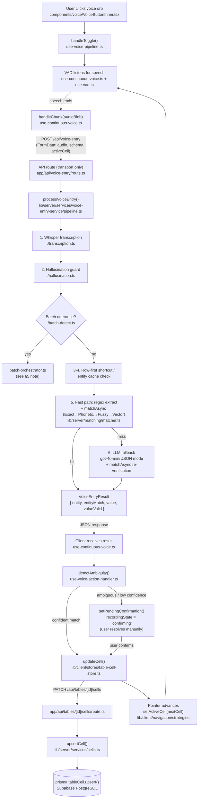
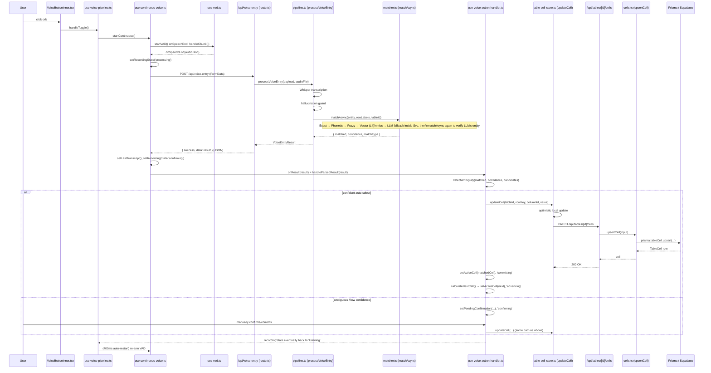

# Voice Entry Pipeline — End to End

**Scope:** Traces a single voice entry from the user clicking the voice button, through
recording, transcription, entity/value resolution, ambiguity handling, and the actual
database write.
**Related:** `05_VOICE_PIPELINE.md`, `06_SMART_POINTER.md`, `07_MATCHING_ENGINE.md`,
`features/10_voice-pipeline-hardening.md`, `features/15_realtime_voice_feedback.md`,
`features/03_ai_table_agent.md` §5 (batch entry variant)

---

## Table of Contents

1. [High-Level Flow](#1-high-level-flow)
2. [Sequence Diagram: Click to DB Write](#2-sequence-diagram-click-to-db-write)
3. [Layer Responsibilities](#3-layer-responsibilities)
4. [Two Separate API Calls — Compute vs. Write](#4-two-separate-api-calls--compute-vs-write)
5. [Server Pipeline Stages (`pipeline.ts`)](#5-server-pipeline-stages-pipelinets)
6. [State Machine Recap](#6-state-machine-recap)

---

## 1. High-Level Flow



---

## 2. Sequence Diagram: Click to DB Write



---

## 3. Layer Responsibilities

| Layer | Location | Responsibility |
|---|---|---|
| Button (declarative) | `components/voice/VoiceButtonInner.tsx` | Pure render — orb state, waveform, transcript echo. No logic. |
| Orchestration hook | `lib/client/hooks/voice/use-voice-pipeline.ts` | Wires all sub-hooks together; owns derived render state and the toggle handler. |
| Recording (manual) | `lib/client/hooks/voice/use-voice-entry.ts` | `MediaRecorder` lifecycle for hold-to-talk. |
| Recording (hands-free) | `lib/client/hooks/voice/use-continuous-voice.ts`, `use-vad.ts` | VAD-driven silence detection; fires the `/api/voice-entry` request per utterance. |
| API route (transport) | `app/api/voice-entry/route.ts` | Auth/rate-limit/Zod validation only — delegates to the service, maps errors to HTTP codes. |
| Server pipeline (compute) | `lib/server/services/voice-entry-service/pipeline.ts` | Whisper STT → hallucination guard → batch gate → cache/fast-path/LLM fallback. **No DB access.** |
| Matching engine | `lib/server/matching/matcher.ts`, `vector-match.ts` | Deterministic Exact → Phonetic → Fuzzy → Vector (semantic) chain; only escalates to LLM on a full miss. |
| Ambiguity + write decision | `lib/client/hooks/voice/use-voice-action-handler.ts` | Client-side `detectAmbiguity()`; decides auto-write vs. ask-user. |
| DB write | `lib/client/stores/table-cell-store.ts` → `app/api/tables/[id]/cells/route.ts` → `lib/server/services/cells.ts` | Optimistic UI update, `PATCH` request, `prisma.tableCell.upsert()`. |
| Pointer advancement | `lib/client/navigation/strategies/` | Decoupled from recording — triggered only after a successful write (`06_SMART_POINTER.md`). |

---

## 4. Two Separate API Calls — Compute vs. Write

The single most important structural fact of this pipeline: **transcription/matching and
persistence are two independent HTTP round-trips**, not one.

| | `POST /api/voice-entry` | `PATCH /api/tables/[id]/cells` |
|---|---|---|
| Purpose | STT + entity/value resolution | The actual write |
| Touches DB? | No | Yes (`prisma.tableCell.upsert`) |
| Triggered by | Every utterance (VAD speech-end, or recording stop) | Only after `detectAmbiguity()` decides the match is confident enough, or the user manually confirms |
| Failure mode | Falls back to LLM, then to `AMBIGUOUS`/`ERROR` — never touches the grid | Rolled back client-side (optimistic update reverted) on failure |

This split is what lets a fuzzy match show a confirmation dialog with **zero** risk of a bad
value silently landing in the database.

---

## 5. Server Pipeline Stages (`pipeline.ts`)

`processVoiceEntry()` runs (roughly) in this order, short-circuiting as early as possible:

1. **Transcription** (`transcription.ts`) — Whisper, with the table's row labels injected as
   a vocabulary prompt for biasing.
2. **Hallucination guard** (`hallucination.ts`) — rejects empty/degenerate output before
   spending an LLM call.
3. **Batch detection gate** (`batch-detect.ts`) — if the utterance looks like multiple
   entries ("Dan 85, Noa 90"), forks entirely to `batch-orchestrator.ts` (see
   `features/03_ai_table_agent.md` §5 for that sub-pipeline).
4. **Row-first mid-row shortcut** (`row-first.ts`) — if the pointer already pins the row,
   skip entity resolution, parse the value directly.
5. **Entity-recognition cache** (`lib/server/cache/entity-recognition-cache.ts`) — hash of
   transcript+tableId short-circuits repeat utterances.
6. **Fast path (no LLM)** — `quick-extract.ts` regex-splits "entity, value", then
   `matchAsync()` (`lib/server/matching/matcher.ts`) resolves the entity through
   **Exact → Phonetic → Fuzzy → Vector** (the vector step is `VectorMatcher` in
   `vector-match.ts`, a local multilingual embedding match — see
   `features/10_voice-pipeline-hardening.md` §3). ≥0.85 confidence returns immediately.
7. **Bare-value fast path** (`bare-value.ts`) — a lone value is attributed to the
   already-active row.
8. **LLM fallback (GPT-4o-mini)** — only reached if the entire matcher chain (including the
   vector step) misses. The LLM extracts `{entity, value}`, and its entity guess is run back
   through **the same `matchAsync()` chain** — the LLM never self-declares a match.

Every branch returns a `VoiceEntryResult`; nothing in this file ever imports Prisma.

---

## 6. State Machine Recap

Drives all `VoiceButtonInner` rendering (`lib/client/stores/ui-store.ts` `recordingState`):

```
idle → listening → processing → confirming → committing → advancing → listening (loop)
```

`error` is reachable from any stage via `use-voice-error-handler.ts`. Continuous mode
auto-restarts `listening` ~400ms after `advancing` (`use-voice-pipeline.ts`), unless the
Smart Pointer reports end-of-table, which stops continuous mode instead.
